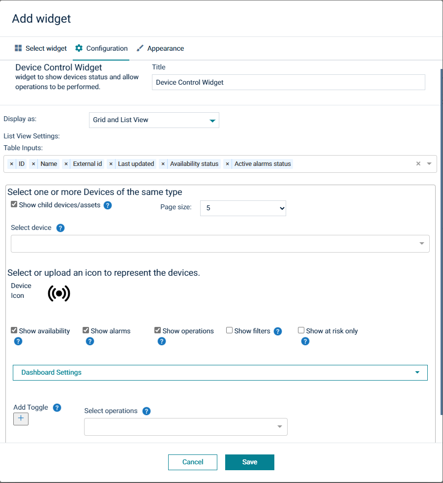
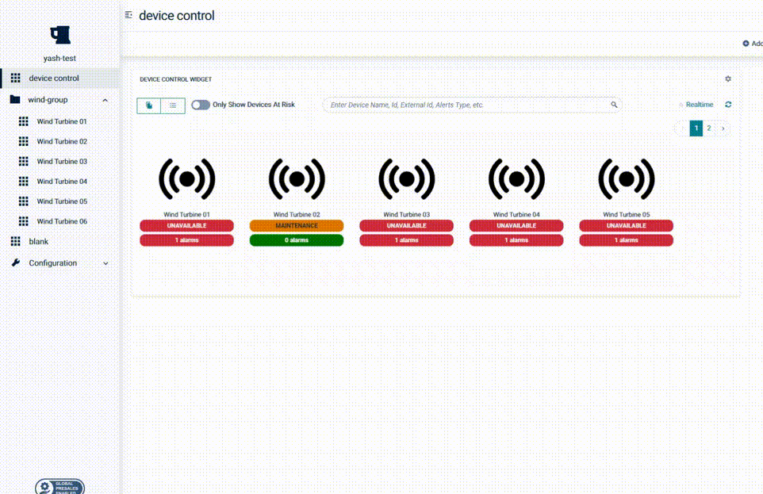

# Device control and status widget [](https://github.com/SoftwareAG/cumulocity-device-control-plugin/releases/download/1.2.2/sag-ps-pkg-device-control-widget-1.2.2.zip)

  

  
This Device Control widget is the Cumulocity module federation plugin created using c8ycli. This plugin can be used in Application Builder or Cockpit.
This widget allows display and control of devices and groups of devices.


### Please choose Device Control release based on Cumulocity/Application builder version:

|APPLICATION BUILDER &nbsp;| &nbsp; CUMULOCITY&nbsp;  | &nbsp; DEVICE CONTROL WIDGET &nbsp; |
|--------------------|-------------|-----------------------|
| 2.x.x              |  >= 1016.x.x| 1.x.x                 | 


## Features

*   The user can select groups and individual devices.
*   The user can use images (including vector graphics) to represent the devices.
*   Select operations and define tooltips, and payload for each.
*   Filter and display **at risk** devices
*   Toggling of flags on the managed object supported.
    *   N.B. referred to as **toggles** below.
*   Supports group template dashboard
*   Realtime update of the managed objects
  
## Prerequisite
   Cumulocity c8ycli >=1016.x.x
   
   
## Installation

### Runtime Widget Deployment?

* This widget support runtime deployment. Download [Runtime Binary](https://github.com/SoftwareAG/cumulocity-device-control-plugin/releases/download/1.2.2/sag-ps-pkg-device-control-widget-1.2.2.zip) and install via Administrations --> Ecosystems --> Applications --> Packages.


## QuickStart

This guide will teach you how to add the widget in your existing or new dashboard.

NOTE: This guide assumes that you have followed the [installation](https://github.com/SoftwareAG/cumulocity-runtime-widget-loader) instructions

1. Open the Application Builder application from the app switcher (Next to your username in the top right)
2. Add a new dashboard or navigate to an existing dashboard
3. Click `Add Widget`
4. Search for `Device Control`.
5. Click `Save`.

Congratulations! Device Control Widget is configured.

## User Guide

The widget configuration page contains a number of configuration attributes.



-   **Title** : Enter the title which will display at the top of your widget

**Layout Options**

-   **Display as** : Select widget's display option from the dropdown.
-   **List view settings** 
    -   **Table inputs** : select the fields to show in list/table view.

**Device Options**
-   **Show child devices/assets** : check to show the child devices/assets of group to be selected.
-   **Page size** : select the number of child devices/assets to show in the page.
-   **Select device** : 
    -   Choose a single group of device/asset when `Show child devices/assets` is checked. 
    -   Choose one or more device/asset when `Show child devices/assets` is unchecked. 
    As you choose the Preview section will update to reflect your choices.


-   **Device icon** : click on the icon to change the displayed image for each device.

-   **Show Availability** : check to show the current status of the device - based on the fragment `c8y_Availability`.

-   **Show alarms** : Check this option to display a pill containing the number of alarms for this device.

-   **Show operations** : Check this option to display the buttons to allow operations and toggles to be invoked.

-   **Show filters** : check to display filter options at the top of widget.

-   **Show at risk only** : Check this option to default the widget to display only those devices that are offline, in maintenance or have alarms.


**Dashboard Settings(Application Builder & Blueprint Forge Only):** This feature is available only in application builder and Blueprint Forge. User can navigate to any other dashboard by providing below details:
-   **Device Type:** Select a device type. Navigation will be applied to all devices/assets of this device/asset type to a specific dashboard.
-   **Dashboard ID:** Dashboard ID of a dashboard where user need to navigate. You can find dashboard id in browser URL.
-   **DeviceId as TabGroup:** Select this option only if you are using Group Template as dashboard in application builder and selected deviceId as tabgroup field during group template configuration.
-   **TabGroup ID(optional):** If your dashboard is based on tabgroup then provide tabgroup id.

**Select operations or add toggles**

> N.B. (reminder) "toggles" are a name for a mechanism the widget provides to flip a boolean fragment on the Managed Object that represents the device. It is intended to be a generic mechanism to help demos, but may well have utility in other areas.

-   **Select operations** : if the selected devices have the `c8y_SupportedOperations` fragment then the list will be displayed here. The list will be a composite of the `c8y_SupportedOperations` fragments from all selected devices with duplicates removed.

After selecting an operation a column of options for the operation will appear.

-   **Display Name** : This is a tool tip which will be displayed when you mouse over the operation on the widget.

-   **Button icon** : select an icon from the font awsome 4 list of icons to represent the selected operation.

-   **payload** : this is an arbitrary payload (json) that will be sent in the operation. Typically the payload can be anything but is the value of a fragment of the operation object that will be sent. a code representation is shown below but the contents of the field will depend wholly on what operation the user selects and what it expects. See [Cumulocity create](http://resources.cumulocity.com/documentation/websdk/client/classes/operationservice.html) section for more details  


```
    //this is an example for supplorted operation 'myOperation'
    //deviceId is supplied by the widget
    let operation: IOperation = {
        deviceId: xxxxxx,
        myOperation: <payload field contents>
    }
```

-   **Add toggle** : Clicking this will add a column, similar to the one added by selecting a command above. However the fields are slightly different.


The following shows the widget responding to the change in managed object flag state. because it has the `c8y_Availability` when the fragment `sag_IsShutDown` is toggled to true (and its status is available) the device shows as being in standby.


**Group template**

You can use this widget with a group template dashboard:


for example the wind turbines group in my examples above:


Now each page can have a widget that displays the device linked to the route selected.



Additionally you can set up a link from the individual devices on the widget to the individuals group page with dashboard settings:


## Widget display

Once configured the widget displays the selected devices, or all devices in a selected group. You can configure the widget to only display "at risk" devices by default also.

Additionally by checking/unchecking the "Only ay risk" option you can change what is seen.

Lastly there is a search facility allowing you to select a subset of devices based off their name.


as shown above in the configuration, if the group dashboard link is set then clicking on the icon will take you to that devices page in the group template dashboard.

The devices will update when the managed objects change.

---

This widget is provided as-is and without warranty or support. They do not constitute part of the Software AG product suite. Users are free to use, fork and modify them, subject to the license agreement. While Software AG welcomes contributions, we cannot guarantee to include every contribution in the master project.

---  

For more information you can Ask a Question in the [TECHcommunity Forums](https://tech.forums.softwareag.com/tags/c/forum/1/Cumulocity-IoT).

You can find additional information in the [Software AG TECHcommunity](https://tech.forums.softwareag.com/tag/Cumulocity-IoT).
